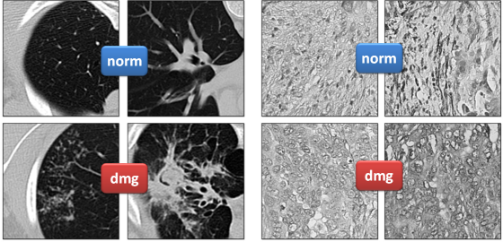

# Superpixeling

The repository contains Python scripts implementing the superpixel-based 2D image analysis algoritms.
This includes:

* Extraction of image descriptors based on histograms of superpixel features.
* Extraction of image descriptors based on co-occurrence matrices of superpixel classes
* Highlighting key regions on the images which differentiate images of two classes.

### Datasets

Two test datasets of 2D biomedical images are available for [download](https://drive.google.com/open?id=1c6gdvI0ipQWkkn30s3LIhB56blN4lf-i).

* A set of 2D regions of Computed Tomography images, `128x128` in size, 270 regions in total, 92 of them containing tuberculosis lesions.
* A set of 2D grayscale histology images of ovary, `256x256` in size, 200 images in total, 100 marked as pathological and 100 as healthy tissue.

Examples of healthy ("norm") and pathological ("dmg") CT and histology images are shown below.

### Scripts

The scripts can be run one-by-one from [run_a_precalculate.py](run_a_precalculate.py) to [run_f_highlight_regions.py](run_f_highlight_regions.py) or by launching the [run_pipeline.py](run_pipeline.py) script.
