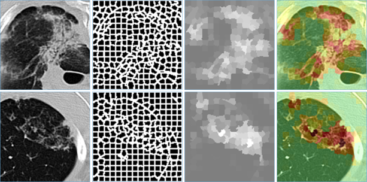

# Superpixeling

The repository contains Python scripts implementing the superpixel-based 2D image analysis algoritms.
This includes:

* Extraction of image descriptors based on histograms of superpixel features.
* Extraction of image descriptors based on co-occurrence matrices of superpixel classes
* Highlighting key regions on the images which differentiate images of two classes.

### Requirements

Python 3.6+ with the neccessary libs (see [requirements.txt](requirements.txt)).

### Test Datasets

Two test datasets of 2D biomedical images are available for [download](https://drive.google.com/open?id=1wo3_om9Hqq97ojl8hfv7GXTC1DwbI8-W).
Extract the datasets into `data` directory prior to running the scripts.

* A set of 2D regions of Computed Tomography images, `128x128` in size, 270 regions in total, 92 of them containing tuberculosis lesions.
* A set of 2D grayscale histology images of ovary, `256x256` in size, 200 images in total, 100 marked as pathological and 100 as healthy tissue.

Examples of healthy ("norm") and pathological ("dmg") CT and histology images are shown below.

### Scripts

The scripts can be run one-by-one from [run01_precalculate.py](run01_precalculate.py) to [run07_highlight_regions.py](run07_highlight_regions.py) or by launching the [run_pipeline.py](run_pipeline.py) script.

### References

[1] Liauchuk, V. [Superpixel co-occurrence for quantitative description  of biomedical images](http://www.elib.bsu.by/bitstream/123456789/158760/1/Liauchuk_Kovalev.pdf) / V. Liauchuk, V. Kovalev // Proc. of the 13-th Int. conference on Pattern Recognition and Information Processing (PRIP’2016). - October, 3-5, Minsk, Belarus, 2016. - Vol. 1. - P. 145-147.

[2] [A method for highlighting lung tuberculosis lesions in CT images using superpixel approach](https://www.researchgate.net/publication/333485161_A_method_for_highlighting_lung_tuberculosis_lesions_in_CT_images_using_superpixel_approach) / V. Liauchuk [et al] // Proc. 30th Int. Congress and Exhibition on Computer Assisted Radiology and Surgery (CARS-2016).  – Heidelberg, Germany, 2016. – Vol. 11. – P. 277-278. 
